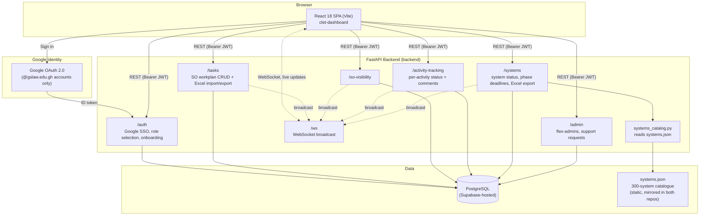

Yeah# GSL M&E Dashboard — Technical Documentation

**Council for Legal Education and Training (CLET) / Ghana School of Law (GSL)**
**System: GSL Monitoring & Evaluation Dashboard**
**Repositories: `backend` (FastAPI API) and `clet-dashboard` (React frontend)**
**Version 1.0 — July 2026**

> This document supersedes the individual `README.md` files in each repository, which describe an earlier version of the system (email/password auth, `dg`/`management`-only roles, no systems catalogue). It reflects the system as it exists today: Google SSO, directorate/statutory-office roles, the 300-system Act 1170 implementation tracker, and everything built on top of it. The two READMEs remain useful for local setup instructions (installing dependencies, running dev servers) — this document covers the *architecture*.

---

## Table of Contents

1. [Overview](#1-overview)
2. [System Architecture](#2-system-architecture)
3. [Backend](#3-backend)
4. [Frontend](#4-frontend)
5. [Data Model](#5-data-model)
6. [Authentication & Authorization](#6-authentication--authorization)
7. [Real-Time Synchronisation](#7-real-time-synchronisation)
8. [The Systems Catalogue](#8-the-systems-catalogue)
9. [Reports](#9-reports)
10. [Deployment](#10-deployment)

---

## 1. Overview

The GSL M&E Dashboard is the tool CLET uses to track two things side by side:

- **The Strategic Objectives workplan** — SO1–SO4, broken into thematic areas, tasks and activities, filled in by each directorate.
- **The Act 1170 digital-transformation programme** — a 300-system catalogue (13 clusters, C1–C13) with per-system status, grouped by implementation phase (1–4) and by the directorate responsible for each system.

On top of these two data sets sit the statutory task lists for the Director-General and the Registrar (extracted directly from Act 1170 §12(2), §14, §16(5) and §81), cross-directorate oversight views, executive analytics dashboards, and Excel/CSV report exports.

Every connected client sees the same data update live, via a WebSocket broadcast fan-out from the backend.

---

## 2. System Architecture



**Request flow.** The React SPA talks to the FastAPI backend exclusively over REST (JSON, Bearer-token auth) plus one long-lived WebSocket connection for live updates. There is no server-rendering and no session cookie — the client is stateless aside from a JWT and a cached user object in `localStorage`.

**Why a static JSON catalogue instead of a database table for the 300 systems.** The system list itself (which systems exist, which cluster and phase they belong to, which directorate owns them) is fixed reference data derived from the Act 1170 Comprehensive Digital System Mapping — it doesn't change through user action. Only the *status* of each system (`Not Started` / `In Progress` / ... / progress %) is live, mutable data, so that's what lives in Postgres (`system_progress` table), keyed by system code. `systems.json` is kept byte-identical between the two repositories; the backend reads it to resolve which directorate owns a system (for access control and exports), the frontend reads it to render the catalogue.

---

## 3. Backend

**Stack:** FastAPI · SQLAlchemy 2.0 (async) + `asyncpg` · Alembic · `python-jose` (JWT) · `openpyxl` (Excel export) · native `websockets` · PostgreSQL (Supabase).

### 3.1 Project layout

```
backend/
  app/
    main.py                    FastAPI app, CORS, startup bootstrap (create tables, seed defaults)
    config.py                  Settings from .env (pydantic-settings)
    database.py                Async engine/session, Base, get_db dependency
    models.py                  SQLAlchemy models
    schemas.py                 Pydantic request/response models
    admin_accounts.py          Hardcoded super-admin email + DG/Registrar overrides
    systems_catalog.py         Loads systems.json, resolves system -> directorate
    core/
      security.py              JWT create/decode, get_current_user, require_role, require_super_admin_email
      google_oauth.py          Google OAuth code exchange + ID token verification
      ws_manager.py            WebSocket connection manager (broadcast helper)
    routers/
      auth.py                  /auth      — Google SSO, role selection, onboarding, /auth/me
      tasks.py                 /tasks     — SO workplan CRUD, Excel import/export
      so_visibility.py         /so-visibility — SO1–4 visibility toggle
      activity_tracking.py     /activity-tracking — per-activity status + threaded comments
      systems_status.py        /systems   — system status, phase deadlines, Excel export
      admin.py                 /admin     — flex-admin management, support-request inbox
      ws.py                    /ws        — WebSocket endpoint
  alembic/                     Migration environment + versions
  systems.json                 The 300-system catalogue (source of truth, mirrored to the frontend)
  Dockerfile, docker-compose.yml
```

### 3.2 API reference

All endpoints except `/health`, `/auth/google/login`, `/auth/google/callback`, `/auth/exchange`, `/auth/role-select/complete` and `/auth/onboarding/complete` require `Authorization: Bearer <token>`.

**Auth — `/auth`**

| Method | Path | Description | Access |
|---|---|---|---|
| GET | `/auth/google/login` | Redirects to Google's OAuth consent screen | public |
| GET | `/auth/google/callback` | Google redirects here; creates/updates the user, issues a short-lived exchange code | public |
| POST | `/auth/exchange` | Exchanges the code for a session, or returns `needs_role_selection` / `needs_onboarding` | public |
| POST | `/auth/role-select/complete` | Flexible-access accounts: commit the chosen directorate/DG/Registrar for this session | public (token-gated) |
| POST | `/auth/onboarding/complete` | First-time staff: commit the self-selected directorate | public (token-gated) |
| GET | `/auth/me` | Current authenticated user | any |

**Tasks (SO workplan) — `/tasks`**

| Method | Path | Description | Access |
|---|---|---|---|
| GET | `/tasks` | List tasks, optional `so_number` filter | any |
| PATCH | `/tasks/{task_id}` | Update a task (broadcasts `TASK_UPDATED`) | staff, super_admin |
| POST | `/tasks/import` | Import an `.xlsx` SO Matrix, replacing tasks for affected SOs (broadcasts `TASKS_UPDATED`) | staff, super_admin |
| GET | `/tasks/export` | Export tasks (optional `so_number` filter) to `.xlsx` | any |

**SO Visibility — `/so-visibility`**

| Method | Path | Description | Access |
|---|---|---|---|
| GET | `/so-visibility` | Visibility map for SO1–SO4 | any |
| PATCH | `/so-visibility/{so_number}` | Toggle visibility (broadcasts `VISIBILITY_UPDATED`) | staff, super_admin |

**Activity Tracking — `/activity-tracking`**

| Method | Path | Description | Access |
|---|---|---|---|
| GET | `/activity-tracking/stats` | Total comment count | any |
| GET | `/activity-tracking/recent` | 20 most recent comments (DG activity feed) | any |
| GET | `/activity-tracking/bulk` | All tracking rows in one call | any |
| GET | `/activity-tracking/{task_id}` | Tracking rows + comments for one task | any |
| PATCH | `/activity-tracking/{task_id}/{activity_ref}` | Upsert status/progress/assignee/date for an activity | any |
| POST | `/activity-tracking/{task_id}/{activity_ref}/comments` | Add a comment | any |

**Systems (300-system catalogue) — `/systems`**

| Method | Path | Description | Access |
|---|---|---|---|
| GET | `/systems/status` | Live status for every tracked system | any |
| PATCH | `/systems/status/{code}` | Update one system's status (broadcasts `SYSTEM_STATUS_UPDATED`) | staff — own directorate only; dg/registrar/super_admin — any system |
| GET | `/systems/deadlines` | The four phase deadlines | any |
| PATCH | `/systems/deadlines/{phase}` | Set a phase deadline (broadcasts `PHASE_DEADLINE_UPDATED`) | dg, registrar, super_admin |
| GET | `/systems/export` | Excel export; optional `directorate=` or `codes=` filter | any |

**Admin — `/admin`**

| Method | Path | Description | Access |
|---|---|---|---|
| GET / POST | `/admin/flex-admins` | List / add a flexible-access email | super admin only (exact email) |
| DELETE | `/admin/flex-admins/{email}` | Remove a flexible-access email | super admin only |
| POST | `/admin/support-requests` | Submit a help/change request | any |
| GET | `/admin/support-requests` | List all requests | super admin only |
| PATCH | `/admin/support-requests/{id}` | Update a request's status | super admin only |

**WebSocket — `/ws`**

Clients connect to `/ws?token=<jwt>` and receive JSON messages with a `type` field: `TASK_UPDATED`, `TASKS_UPDATED`, `VISIBILITY_UPDATED`, `SYSTEM_STATUS_UPDATED`, `PHASE_DEADLINE_UPDATED`. Sending the text `"ping"` returns `"pong"` as a keepalive.

### 3.3 Startup bootstrap

`app/main.py`'s `_bootstrap()` runs on every startup: it calls `Base.metadata.create_all()` (so a fresh database gets its full schema without running Alembic), seeds `SOVisibility` rows for SO1–SO4, and seeds `PhaseDeadline` rows from `systems.json`'s `phase_deadlines` block — all idempotently (only inserted if missing).

---

## 4. Frontend

**Stack:** React 18 + Vite · React Router v6 · Zustand · Recharts · Framer Motion · Tailwind CSS · Lucide icons · native WebSocket.

### 4.1 Project layout

```
clet-dashboard/
  src/
    main.jsx                        ReactDOM entry point
    App.jsx                         Router + providers + route table
    api/client.js                   Fetch wrapper (auth header, 401 handling, download/upload helpers)
    store/useDataStore.js           Zustand store: tasks, systemStatus, phaseDeadlines, visibility, stats
    context/AuthContext.jsx         Auth state, Google SSO exchange, onboarding, role selection
    hooks/useRealtimeSync.js        WebSocket lifecycle + initial data fetch
    utils/helpers.js                Constants, directorate/cluster maps, CSV/report helpers
    data/
      systems.json                  Mirror of backend/systems.json
      statutoryTasks.js             DG (14) and Registrar (5) statutory functions, from Act 1170
    components/
      auth/                         LoginPage, AuthCallbackPage, ProtectedRoute
      layout/                       Header (role-aware nav), ThemeToggle
      dashboard/                    DGDashboard, StatutoryTasksPage, SystemsStatusPage,
                                     OversightSystemsPage, SystemDetailPage, SystemsOverviewPanel
      management/                  ManagementHome, SODetailPage, ThematicAreaPage, TaskDetailPage
      admin/                       SuperAdminPage
      shared/                      RequestHelpPage, PhaseTimeline, PhaseCountdown, AnalyticsWidgets, Toast
```

### 4.2 Routes

| Path | Component | Access |
|---|---|---|
| `/login` | `LoginPage` | public |
| `/auth/callback` | `AuthCallbackPage` | public (handles the OAuth code exchange, onboarding, and role selection) |
| `/dashboard` | `DGDashboard` | dg, registrar, super_admin |
| `/dashboard/so/:soNumber` | `DGSODetailPage` | dg, registrar, super_admin |
| `/statutory-tasks` | `StatutoryTasksPage` | dg, registrar, super_admin |
| `/systems` | `SystemsStatusPage` | dg, registrar, super_admin |
| `/oversight-systems` | `OversightSystemsPage` | dg, registrar |
| `/systems/:systemCode` | `SystemDetailPage` | staff, dg, registrar, super_admin |
| `/management` | `ManagementHome` | staff, super_admin |
| `/management/systems` | `ManagementHome` (systems tab) | staff, super_admin |
| `/management/so/:soNumber` | `SODetailPage` | staff, super_admin |
| `/management/so/:soNumber/area/:areaIndex` | `ThematicAreaPage` | staff, super_admin |
| `/management/so/:soNumber/area/:areaIndex/task/:taskId` | `TaskDetailPage` | staff, super_admin |
| `/admin` | `SuperAdminPage` | super_admin (and the exact hardcoded email) |
| `/help` | `RequestHelpPage` | any authenticated user |
| `*` | Redirect to `/login` | — |

`ProtectedRoute` enforces role-based access against `AuthContext`'s `user.role`; unauthenticated users are redirected to `/login`.

### 4.3 Global state (Zustand)

`useDataStore` holds `tasks[]`, `systemStatus{}` (keyed by system code), `phaseDeadlines{}` (keyed by phase 1–4), `soVisibility`, `totalComments`/`recentComments[]`. Writes are optimistic: the store updates immediately, then rolls back if the API call fails. Key selectors: `getSOSummaries()` (per-SO progress) and `getDirectorateAreas(directorate)`.

### 4.4 Real-time sync

`useRealtimeSync()`, mounted on every data-bearing page, fetches initial state via REST, opens `/ws?token=<jwt>`, and applies incoming broadcast events directly to the store (no refetch needed for system/phase updates; task/visibility updates trigger a refetch). It reconnects automatically on an unexpected close and pings every ~25s to keep the connection alive.

---

## 5. Data Model

| Table | Key Fields | Purpose |
|---|---|---|
| `users` | email, name, role, directorate, google_id | Identity and role/directorate scoping |
| `tasks` | so_number, thematic_area, task, status, progress_pct, assigned_to, target_date, notes | Strategic Objectives workplan items |
| `activity_tracking` | task_id, activity_ref, status, progress_pct, assigned_to, target_date | Per-activity status, one row per activity reference |
| `activity_comments` | tracking_id, author_name, content | Threaded comments on an activity |
| `so_visibility` | so_number, is_visible | Whether an SO is shown on dashboards |
| `system_progress` | system_code, status, progress_pct, updated_by, updated_at | Live status of one of the 300 catalogue systems |
| `phase_deadlines` | phase, deadline, updated_by, updated_at | One shared deadline per implementation phase (1–4) |
| `flex_admins` | email, added_by | Emails required to choose their access on every sign-in |
| `support_requests` | requester_email, requester_name, message, status | In-app help/change request inbox |

`Directorate` enum: `GSL, CDT, AQAI, LRKS, DTI, CCP, PTC, FRM, SFL, CA`. `UserRole` enum: `staff, dg, registrar, super_admin`.

Statutory task state (the Director-General's 14 and the Registrar's 5 Act 1170 functions) has **no backend table yet** — it lives in browser `localStorage` per user, a known limitation distinct from everything else in this list, which is backend-persisted and shared live across sessions.

---

## 6. Authentication & Authorization

1. **Sign-in** is Google OAuth 2.0, restricted server-side to the `@gslaw.edu.gh` domain.
2. **Role resolution** on `/auth/google/callback`, checked in this order:
   - Hardcoded super admin (`app/admin_accounts.py`, currently one email) → `super_admin`.
   - Hardcoded DG/Registrar overrides (same file, currently unused/empty) → `dg` / `registrar`.
   - Otherwise → `staff`, directorate left unset.
3. **On every `/auth/exchange` call** (i.e. every sign-in, not just the first):
   - If the email is on the `flex_admins` allowlist → the client is sent to a "choose your access" screen (10 directorates + Director-General + Registrar) every time, regardless of what was chosen last session. Selecting an option calls `/auth/role-select/complete`, which overwrites the user's `role`/`directorate` for that session.
   - Else if the user is `staff` with no `directorate` set → one-time onboarding (self-select a directorate, remembered from then on).
   - Else → normal session issued immediately.
4. **Authorization** is enforced server-side on every write endpoint by re-reading the authenticated user's `role`/`directorate` from the database (never trusting client-supplied role claims) — e.g. a staff member's token cannot update another directorate's system status even via a direct API call.
5. **The Super Admin page** (`/admin`) is gated both by role (`ProtectedRoute allowedRoles={['super_admin']}`) and, on the backend, by an exact-email check (`require_super_admin_email`) — not merely "anyone with the super_admin role" — so it stays scoped to the one hardcoded account even if the role were ever assigned elsewhere.

---

## 7. Real-Time Synchronisation

Every mutation broadcasts a typed WebSocket message to all connected clients after it commits:

| Event | Emitted by | Client reaction |
|---|---|---|
| `TASK_UPDATED` / `TASKS_UPDATED` | `/tasks` PATCH / import | Refetch tasks |
| `VISIBILITY_UPDATED` | `/so-visibility` PATCH | Apply directly to store |
| `SYSTEM_STATUS_UPDATED` | `/systems/status/{code}` PATCH | Apply directly to store |
| `PHASE_DEADLINE_UPDATED` | `/systems/deadlines/{phase}` PATCH | Apply directly to store |

This is what makes two people editing different directorates' data, or one person editing a phase deadline while another watches the Executive Dashboard, converge within seconds without a manual refresh.

---

## 8. The Systems Catalogue

`systems.json` (identical copies in both repos) describes 13 clusters (C1–C13), each with a `directorate_code` and a flat list of systems (`code`, `name`, `phase`, `description`, `source_cluster`, optional per-system `directorate` override). Two clusters — C1 and C12+C13 — are owned by the Registrar's and the Director-General's statutory offices respectively rather than an operating directorate; those systems are only reachable through the DG/Registrar oversight tabs and the cross-directorate dashboard, never through a staff directorate page.

`app/systems_catalog.py` loads this file once at import time and exposes `get_system_directorate(code)` (used for access control) and `list_all_systems()` (used for exports). The frontend's `utils/helpers.js` derives `DIRECTORATE_TO_CLUSTERS` from the same file, so every directorate badge in the UI can show its owning cluster code(s) without a second hardcoded map.

---

## 9. Reports

| Report | Trigger | Format | Scope |
|---|---|---|---|
| SO Task Matrix | "Download Report" / SO Detail export | `.xlsx` (server-generated) | One SO, or all SOs |
| Systems Status | "Download Report" on any systems page | `.xlsx` (server-generated) | All 300 systems, one directorate, or an arbitrary code list (oversight tabs) |
| Statutory Tasks (DG/Registrar) | "Download Report" on the statutory tasks views | `.csv` (client-generated) | The current mandate's tasks — client-side because this data isn't backend-persisted (§5) |

Excel reports are built with `openpyxl` and streamed from the backend; the statutory-task CSV is built in the browser from the same `localStorage` state the page renders from.

---

## 10. Deployment

- **Backend**: Docker (`docker-compose.yml` — Postgres + API), or any ASGI host pointed at a Postgres instance via `DATABASE_URL`. `DATABASE_SSL_REQUIRE` toggles SSL for local Postgres vs. a hosted instance (e.g. Supabase). Alembic migrations live in `alembic/`; a fresh database also gets its schema automatically from `Base.metadata.create_all()` on startup.
- **Frontend**: static Vite build (`npm run build` → `dist/`), pointed at the backend via `VITE_API_URL`.
- **CORS**: configured in `app/main.py`; tighten the allowed-origins list for production if cookies/credentials are ever introduced.
